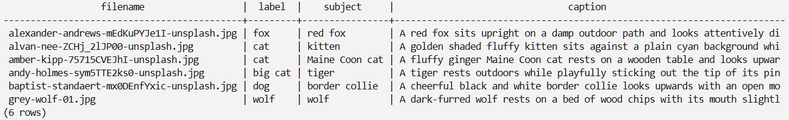
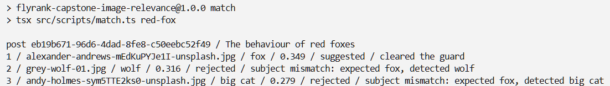
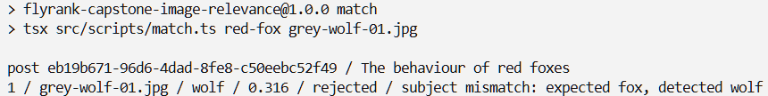
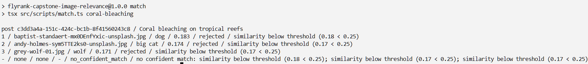

# Evidence

Implementation notes and command output from a local run for core checklist items under the 'Definition of Done' heading in the capstone project pdf. Postgres and Redis were started with `docker compose`. `npm run worker` was left running in a second terminal.

## Schema

`ImageAnnotationSchema` in [src/types.ts](src/types.ts) defines `subject`, `category`, `attributes`, `caption`, and `confidence`. `processAnnotate` in [src/jobs.ts](src/jobs.ts) runs `safeParse` on the Gemini response. Failed validation throws before `saveImageAnnotation`, and BullMQ retries the job up to 3 times.

`ImageLabelSchema` defines `label`, `score`, `runnerUpLabel`, and `runnerUpScore`.

```text
> tsx --test src/*.test.ts

✔ ImageAnnotationSchema accepts the brief tag JSON (2.0941ms)
✔ ImageAnnotationSchema rejects missing subject (0.5424ms)
✔ ImageAnnotationSchema rejects an empty caption (0.2527ms)
✔ ImageAnnotationSchema rejects more than 8 attributes (0.2215ms)
✔ ImageAnnotationSchema rejects confidence outside 0-1 (0.2199ms)
✔ ImageLabelSchema accepts a valid label (1.728ms)
✔ ImageLabelSchema rejects an unknown animal name (0.5057ms)
```

## Background jobs

One BullMQ queue handles `embed_image`, `annotate_image`, and `embed_post`. `jobAttempts` is 3 and `jobBackoffMs` is 2000 in [src/config.ts](src/config.ts). The worker writes `jobs.status` and increments `attempts`.

```text
      type      |  status   | jobs | max_attempts
----------------+-----------+------+--------------
 annotate_image | succeeded |    6 |            3
 embed_image    | succeeded |    6 |            1
 embed_post     | succeeded |    2 |            3
(3 rows)
```

Gemini writes `subject`, `category`, `attributes`, and `caption`.

```text
> docker compose exec postgres psql -U flyrank -d flyrank -c "SELECT filename, label, subject, left(caption, 70) AS caption FROM images ORDER BY filename;"
```



## Model usage logging

`recordUsage` inserts an `ai_usage` row in a `finally` block, so a failed call still gets a row. Jina is recorded as `kind = 'local_embed'`, `cost_usd = 0`. Gemini is recorded as `kind = 'vision'` at the list price in [src/config.ts](src/config.ts) (`$0.00002` per image).

```text
    kind     |    provider     | calls | cost_usd | runtime_ms
-------------+-----------------+-------+----------+------------
 local_embed | transformers.js |    19 | 0.000000 |      23282
 vision      | gemini          |    50 | 0.001000 |     194390
(2 rows)
```

## Label confidence

Jina writes `label`, `label_score`, `runner_up_label`, and `runner_up_score`. `labelStatus` in [src/labels.ts](src/labels.ts) sets `images.status` to `processed` when `score >= 0.70` and `score - runnerUpScore >= 0.15`; otherwise it sets `flagged`. The scores below are softmax over eight prompts.

```text
                  filename                  |  label  | score | runner_up | status
--------------------------------------------+---------+-------+-----------+---------
 alexander-andrews-mEdKuPYJe1I-unsplash.jpg | fox     | 0.134 |     0.127 | flagged
 alvan-nee-ZCHj_2lJP00-unsplash.jpg         | cat     | 0.135 |     0.129 | flagged
 amber-kipp-75715CVEJhI-unsplash.jpg        | cat     | 0.135 |     0.127 | flagged
 andy-holmes-sym5TTE2ks0-unsplash.jpg       | big cat | 0.130 |     0.128 | flagged
 baptist-standaert-mx0DEnfYxic-unsplash.jpg | dog     | 0.135 |     0.130 | flagged
 grey-wolf-01.jpg                           | wolf    | 0.134 |     0.127 | flagged
(6 rows)
```

Guard check 2 rejects `flagged` images. The table above is from an earlier ingest that stored softmax over eight prompts. Current ingest stores raw dots; see Label sweep.

## Database

Six application tables plus `schema_migrations`. Gemini fields live on `images`. `suggestions.review` is `pending` on a `suggested` row until `POST /suggestions/:id/review`.

```text
     tablename     |                indexname
-------------------+------------------------------------------
 ai_usage          | ai_usage_created_at_idx
 ai_usage          | ai_usage_pkey
 embeddings        | embeddings_owner_type_owner_id_model_key
 embeddings        | embeddings_pkey
 images            | images_content_hash_key
 images            | images_pkey
 images            | images_status_idx
 jobs              | jobs_idempotency_key_key
 jobs              | jobs_pkey
 posts             | posts_pkey
 schema_migrations | schema_migrations_pkey
 suggestions       | suggestions_pkey
 suggestions       | suggestions_post_id_idx
(13 rows)
```

## Post embeddings and ranking

`npm run seed-posts` reads `data/posts/*.md`, upserts `posts` (including `expected_label` when the front matter has one), and enqueues `embed_post`. The worker encodes `title` and `body` with Jina and writes `embeddings` with `owner_type = 'post'`.

```text
> tsx src/scripts/seed-posts.ts

queued embed_post coral-bleaching.md (Coral bleaching on tropical reefs)
queued embed_post red-fox.md (The behaviour of red foxes)
seed-posts done: queued=2 skipped=0
```

`npm run match` loads the post vector and every image vector for `EMBED_MODEL`, sorts by cosine, and runs the guard on the top three. `replaceSuggestions` deletes existing rows for that post and inserts the new ones.

```text
> tsx src/scripts/match.ts red-fox
```



```text
 rank |                  filename                  | similarity | decision  | review
------+--------------------------------------------+------------+-----------+---------
    1 | alexander-andrews-mEdKuPYJe1I-unsplash.jpg |      0.349 | suggested | pending
    2 | grey-wolf-01.jpg                           |      0.316 | rejected  |
    3 | andy-holmes-sym5TTE2ks0-unsplash.jpg       |      0.279 | rejected  |
(3 rows)
```

The article title is "The behaviour of red foxes". The body opens with `Vulpes vulpes`. The image filenames are Unsplash hashes. The fox image ranks first at cosine `0.349`; the wolf image is `0.316`. Matching uses the stored Jina vectors.

## Guard

[src/guard.ts](src/guard.ts) is a pure function. Checks run in order; the first failure is the `reason`.

1. Cosine below `cosineMin` (`0.25`).
2. `flagged` status or a weak Jina score/margin. On after the raw-dot retune; see Label sweep.
3. Top-1 minus top-2 gap. Not implemented.
4. `posts.expected_label` set and different from `images.label`.
5. Gemini `subject` present and in conflict with `images.label`. A null `subject` is skipped unless `--require-tags` is passed.

An optional second argument selects one image and runs the guard on that pair, independent of rank order.

```text
> tsx src/scripts/match.ts red-fox grey-wolf-01.jpg
```



`expected_label` on the article is `fox`. `images.label` on `grey-wolf-01.jpg` is `wolf`.

The coral article has no `expected_label`, so check 4 is skipped. All three cosines are below `0.25`.

```text
> tsx src/scripts/match.ts coral-bleaching
```



```text
> tsx --test src/*.test.ts

✔ fox post with a fox image is suggested (0.9175ms)
✔ fox post with a wolf image rejects on subject mismatch (0.4278ms)
✔ cosine under the floor rejects before a subject mismatch (0.1312ms)
✔ null expectedLabel skips the species check (0.1072ms)
✔ null subject passes when tags are not required (0.1465ms)
✔ null subject rejects when tags are required (0.1137ms)
✔ Gemini red fox against Jina wolf rejects on metadata disagreement (0.1595ms)
✔ subjectAgreesWithLabel matches a longer label first (0.091ms)
✔ identical vectors give cosine 1 (0.7513ms)
✔ orthogonal vectors give cosine 0 (0.1092ms)
✔ rankByCosine sorts descending and starts rank at 1 (1.483ms)
```

`npm test` does not load Jina or call Gemini. Full run after Phase 4: 31 passed (schema, guard, cosine, softmax, HTTP stubs).

## Review API

`npm run serve` binds to `localhost:3000`. Handlers call `rankForPost` on stored vectors. They do not import `src/ai/`.

GET does not call `replaceSuggestions`. POST does, then returns the same JSON.

```text
> curl.exe -s http://localhost:3000/posts/red-fox/images
{"post":{"id":"eb19b671-96d6-4dad-8fe8-c50eebc52f49","title":"The behaviour of red foxes"},"candidates":[{"filename":"alexander-andrews-mEdKuPYJe1I-unsplash.jpg","label":"fox","similarity":0.34923950679860055,"decision":"suggested","reason":"cleared the guard","caption":"A red fox sits upright on a damp outdoor path and looks attentively directly ahead."},{"filename":"grey-wolf-01.jpg","label":"wolf","similarity":0.3159532176534087,"decision":"rejected","reason":"subject mismatch: expected fox, detected wolf","caption":"A dark-furred wolf rests on a bed of wood chips with its mouth slightly open."},{"filename":"anvesh-baru-2ZXrBR4ByAQ-unsplash.jpg","label":"bear","similarity":0.2919381243621981,"decision":"rejected","reason":"subject mismatch: expected fox, detected bear","caption":null}],"no_confident_match":null}
```

```text
> curl.exe -s -X POST http://localhost:3000/posts/red-fox/images
```

The POST body matches the GET body. `replaceSuggestions` writes the three candidate rows plus no extra `no_confident_match` row here, because one candidate is `suggested`.

```text
> curl.exe -s "http://localhost:3000/posts/red-fox/images?image=grey-wolf-01.jpg"
{"post":{"id":"eb19b671-96d6-4dad-8fe8-c50eebc52f49","title":"The behaviour of red foxes"},"candidates":[{"filename":"grey-wolf-01.jpg","label":"wolf","similarity":0.3159532176534087,"decision":"rejected","reason":"subject mismatch: expected fox, detected wolf","caption":"A dark-furred wolf rests on a bed of wood chips with its mouth slightly open."}],"no_confident_match":{"reason":"no confident match: subject mismatch: expected fox, detected wolf"}}
```

```text
> curl.exe -s http://localhost:3000/posts/coral-bleaching/images
{"post":{"id":"c3dd3a4a-151c-424c-bc1b-8f41560243c8","title":"Coral bleaching on tropical reefs"},"candidates":[{"filename":"diana-shchurova-tDRZNFrz9yA-unsplash.jpg","label":"cow","similarity":0.1886920793445619,"decision":"rejected","reason":"similarity below threshold (0.19 < 0.25)","caption":null},{"filename":"baptist-standaert-mx0DEnfYxic-unsplash.jpg","label":"dog","similarity":0.1834621438683054,"decision":"rejected","reason":"similarity below threshold (0.18 < 0.25)","caption":"A cheerful black and white border collie looks upwards with an open mouth against a blurred background."},{"filename":"ben-moreland-auijD19Byq8-unsplash.jpg","label":"chicken","similarity":0.18281802457811389,"decision":"rejected","reason":"similarity below threshold (0.18 < 0.25)","caption":null}],"no_confident_match":{"reason":"no confident match: similarity below threshold (0.19 < 0.25); similarity below threshold (0.18 < 0.25); similarity below threshold (0.18 < 0.25)"}}
```

```text
> curl.exe -s http://localhost:3000/suggestions/7d66c1a0-27ce-4fd1-ac72-1acf464fed19
{"id":"7d66c1a0-27ce-4fd1-ac72-1acf464fed19","filename":"alexander-andrews-mEdKuPYJe1I-unsplash.jpg","caption":"A red fox sits upright on a damp outdoor path and looks attentively directly ahead.","label":"fox","labelScore":0.38596183,"runnerUpScore":0.33212414,"similarity":0.3492395,"decision":"suggested","reason":"cleared the guard","review":"pending","reviewedAt":null}
```

```text
> curl.exe -s -X POST http://localhost:3000/suggestions/7d66c1a0-27ce-4fd1-ac72-1acf464fed19/review -H "Content-Type: application/json" --data-binary "@tmp-review.json"
{"id":"7d66c1a0-27ce-4fd1-ac72-1acf464fed19","filename":"alexander-andrews-mEdKuPYJe1I-unsplash.jpg","caption":"A red fox sits upright on a damp outdoor path and looks attentively directly ahead.","label":"fox","labelScore":0.38596183,"runnerUpScore":0.33212414,"similarity":0.3492395,"decision":"suggested","reason":"cleared the guard","review":"approved","reviewedAt":"2026-08-25T01:26:31.596Z"}
```

The review body was `{"review":"approved"}`. Zod `safeParse` on any other value returns 400.

HTTP tests in [src/http.test.ts](src/http.test.ts) use in-memory stubs: unknown post → 404; no embedding → 409; GET does not call `replaceSuggestions`; POST does; bad review body → 400; `no_confident_match` review → 400; approve sets `review`.

## Matching eval

[data/eval/labels.json](data/eval/labels.json) has 20 rows: two articles per species for the nine animal labels, plus coral bleaching and steam turbine as `image: null`. Gold filenames are top-level library files. `npm run eval` calls `rankForPost` with no image override.

```text
> npm run eval
Top-1 precision: 95% on 20 labeled posts
cosine sweep:
  0.20 → 95% (19/20)
  0.22 → 95% (19/20)
  0.25 → 95% (19/20)
  0.28 → 75% (15/20)
  0.30 → 60% (12/20)
```

The miss is `cat-hunting`: top three are wolf, tiger, and fox, all `subject mismatch` against `expected_label` `cat`. `cosineMin` stays `0.25`.

## Label sweep

`npm run eval-labels` scores 50 photos under `data/images/eval/{gold}/`. Folder name is gold. The script calls Jina and does not write `images` or `embeddings`.

```text
Top-1 accuracy: 100.0% on 50 photos
winning raw dots min/max: 0.288 0.428
winning softmax T=1 min/max: 0.105 0.114
```

The confusion table is diagonal (5 per class). Argmax does not change with softmax temperature. Softmax T=1 never reaches the old `0.70` floor; the entire softmax grid at score `>= 0.12` flags all 50 photos.

Raw-dot grid, margin `0.01`: 47 processed, 3 flagged, top-1 among processed `1.0`. Ingest now stores the raw dot. `labelScoreMin = 0.25`, `labelMarginMin = 0.01`. Guard check 2 is on. After re-ingest, all 10 library photos are `processed`.

Full table: `data/eval/label-sweep.json` (gitignored).

Current library rows (raw dots):

```text
                   filename                    |  label  | score | runner | margin |  status
-----------------------------------------------+---------+-------+--------+--------+-----------
 alexander-andrews-mEdKuPYJe1I-unsplash.jpg    | fox     | 0.386 |  0.332 |  0.054 | processed
 alvan-nee-ZCHj_2lJP00-unsplash.jpg            | cat     | 0.358 |  0.310 |  0.049 | processed
 amber-kipp-75715CVEJhI-unsplash.jpg           | cat     | 0.345 |  0.288 |  0.057 | processed
 andy-holmes-sym5TTE2ks0-unsplash.jpg          | tiger   | 0.402 |  0.346 |  0.056 | processed
 anvesh-baru-2ZXrBR4ByAQ-unsplash.jpg          | bear    | 0.390 |  0.331 |  0.059 | processed
 baptist-standaert-mx0DEnfYxic-unsplash.jpg    | dog     | 0.364 |  0.320 |  0.044 | processed
 benjamin-raffetseder-oUIc4XH-VUY-unsplash.jpg | deer    | 0.390 |  0.362 |  0.028 | processed
 ben-moreland-auijD19Byq8-unsplash.jpg         | chicken | 0.415 |  0.335 |  0.080 | processed
 diana-shchurova-tDRZNFrz9yA-unsplash.jpg      | cow     | 0.368 |  0.353 |  0.015 | processed
 grey-wolf-01.jpg                              | wolf    | 0.397 |  0.344 |  0.053 | processed
```

## Known limitations

HTTP has no auth and binds to localhost.

`cosineMin = 0.25` is the floor used on the 20-post file above. `0.28` drops matching precision to 75%.

Gemini `confidence` does not set `images.status` and does not rank.

Guard check 5 compares Gemini `subject` to the Jina `label` when `subject` contains a word from `IMAGE_LABELS`. `kitten` and `border collie` do not contain one, so those two skip the check. Newly copied library photos may have a null `caption` until annotate runs.
